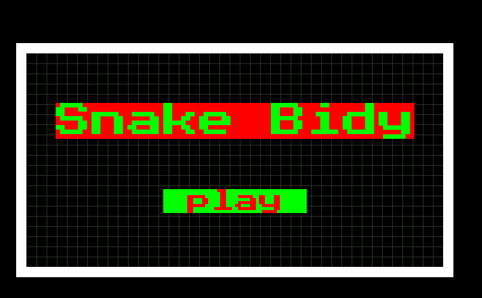
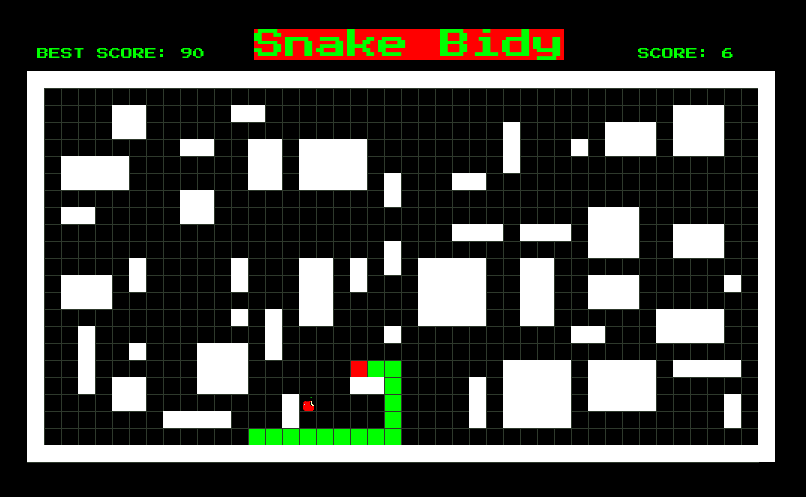
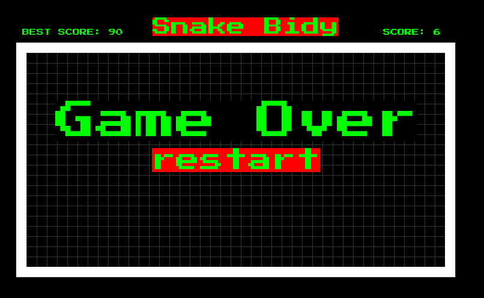

# 🐍 SNAKE BIDY

[](https://www.python.org/downloads/)
[](https://www.pygame.org/)
[](https://opensource.org/licenses/Apache-2.0)

**Snake Bidy** est un jeu de serpent rétro-moderne développé intégralement en **Python** et **Pygame** en 2022. Conçu de manière rigoureuse selon les principes de la **Programmation Orientée Objet (POO)** et sans aucune assistance par IA (uniquement via la documentation officielle), le jeu se distingue par un système de génération procédurale d'obstacles rendant chaque session de jeu unique.

---

## 🖼️ Aperçu du Jeu (Screenshots)

Voici un aperçu visuel de l'interface et du design de l'application à travers ses trois états principaux.

| 🏠 Écran d'Accueil | 🎮 Gameplay (Labyrinthe Évolutif) | 💀 Écran de Game Over |
| :---: | :---: | :---: |
|  |  |  |

---

## 🚀 Fonctionnalités Clés

* **Génération Procédurale de Labyrinthes :** À chaque nouvelle session, un labyrinthe unique est généré dynamiquement sur la grille. La densité des obstacles s'adapte de manière adaptative en fonction du meilleur score du joueur, cassant la monotonie du jeu classique et élevant le défi à chaque record battu.
* **Moteur de Collisions Avancé :** Gestion précise des masques de collision avec détection de trois conditions de défaite critiques :
    * Impact avec les limites du terrain.
    * Impact avec les structures architecturales générées (obstacles).
    * Auto-collision (le serpent croise son propre corps).
* **Système de Score & Courbe de Difficulté :** Calcul en temps réel de la croissance du serpent à chaque unité de nourriture consommée. Intégration d'un catalogue de nourriture varié (pommes, bananes, fraises, fruits mystères) apportant un gameplay dynamique avec des valeurs de points et des raretés différentes.
* **Gestionnaire d'États (State Machine) :** Prise en charge fluide des transitions de jeu, incluant le menu d'accueil dynamique, les fonctions de Pause et de Reprise instantanées, ainsi que l'écran de Game Over.
* **Design Multiplateforme & Éco-système Adaptatif (Responsive) :** * **Indépendance de la Résolution :** Le jeu détecte automatiquement l'espace disponible (PC, Web/Pygbag, ou Mobile Portrait) et recalcule dynamiquement le nombre de cases de la grille pour occuper l'espace de manière optimale.
    * **Paddings et Marges Relatives :** Configuration précise des zones d'affichage via des ratios de pourcentages, garantissant un espace dédié et aéré pour l'interface utilisateur.
    * **UI/UX Dynamique :** Centralisation de la gestion typographique (`getFont`) et calcul automatique de la taille des polices (Titre, Boutons, Scores) pour qu'elles restent proportionnelles et parfaitement confinées à l'écran, sans jamais déborder.
    * **Optimisation Visuelle (Contraste Élevé) :** Amélioration de la visibilité des assets sur fond noir via des animations de pulsation de taille (ondes sinusoïdales) et l'application de contours (silhouettes) sur les sprites pour un rendu typé Arcade de qualité professionnelle.
---

## 🕹️ Contrôles & Commandes

Les entrées clavier ont été mappées pour offrir une réactivité maximale :

* **Navigation :** `Flèches Directionnelles` (HAUT, BAS, GAUCHE, DROITE)
* **Mettre en Pause :** Touche `ESPACE`
* **Reprendre la Partie :** Touche `ENTRÉE`
* **Lancer une Session :** Clic sur le bouton **Play** de l'écran d'accueil.

---

## 🏗️ Architecture Technique & Stack

Le code source a été structuré de manière modulaire afin de respecter les bonnes pratiques de génie logiciel :

* **Paradigme :** Programmation Orientée Objet (POO) avec encapsulation des responsabilités (classes distinctes pour la gestion du Serpent, de la Nourriture, de la Grille et du GameManager).
* **Algorithme d'AABB fait maison :** Implémentation manuelle du calcul des intersections de boîtes englobantes alignées sur les axes pour les collisions, sans dépendre exclusivement des helpers de Pygame.
* **Mouvement Récursif :** Utilisation d'une fonction récursive pour propager le déplacement de la tête sur l'ensemble des segments du corps du serpent.
* **Langage :** Python 3.9.5
* **Moteur Graphique :** Pygame

---

## 🇲🇬 Clin d'œil Linguistique & Algorithmique (Malagasy)

Une des plus grandes particularités de ce projet réside dans son nommage. C'était la première fois que je développais un projet de cette envergure. Pour maximiser ma compréhension et conceptualiser correctement la logique métier avant de coder, j'ai choisi de raisonner et de nommer les entités clés dans ma langue maternelle. 

Ce choix spontané de l'époque témoigne d'une démarche d'analyse approfondie et confère au code une identité unique et authentique.

On retrouve ainsi ce lexique local au cœur des mécaniques du jeu :
* **`Sakafo`** : La classe autonome qui modélise et gère la nourriture sur la grille.
* **`voaHinana()`** (dans la classe `Sakafo`) : La fonction critique qui vérifie si la nourriture vient d'être mangée par le serpent (déclenche la croissance et le score).
* **`midona()`** (dans la classe `Serpent`) : La méthode principale de gestion des impacts (lorsque le serpent percute son propre corps ou un obstacle externe).
* **`serp.maty == 1`** : L'état booléen/numérique qui définit la mort du serpent et déclenche l'écran de Game Over.
* **`sonsMinana`** : Le gestionnaire de bruitage lié à l'action de manger.

---

## 🛠️ Installation et Lancement

### 1. Prérequis
Assurez-vous que Python 3.9+ est installé sur votre système.

### 2. Dépendances
Installez le framework Pygame via le gestionnaire de paquets :
```bash
python3 -m pip install pygame
```

### 3. Execution de code

Clonez le dépôt puis lancez le point d'entrée principal :

```bash
python3 main.py
```

## 👤 Auteur

* **Mbolatiana Anjarasoa Sarobidy Andriatseheno** - *Développeur Logiciel / Game Dev*

* **Projet Core historique développé en 2022 (période de transition académique L1/L2).**